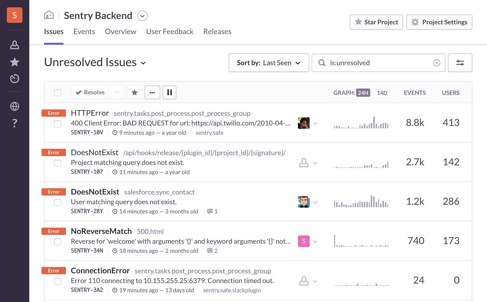
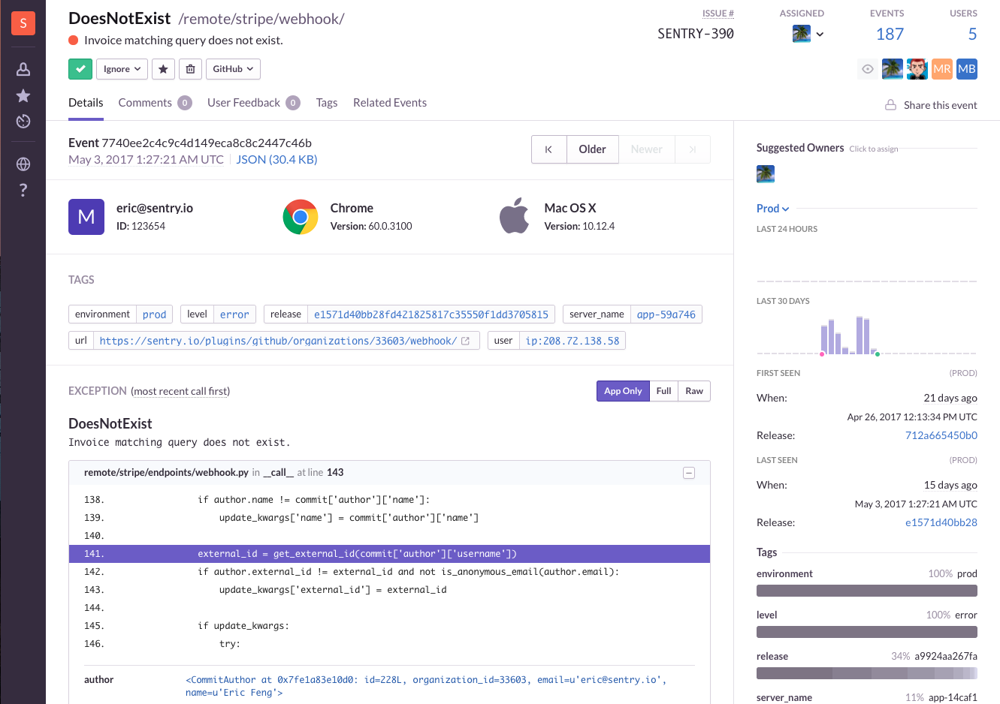

# 前端日志上报

## 脚本错误

浏览器端错误可以通过两种机制获取：

* try catch（外层作用域不能获取异步错误）
* window.onerror（有跨域限制，需要crossorigin和配置http CORS）

## 错误上报

可以通过HTTP请求上报。若访问量大，可以设计一套机制限制频率。

## 文件加载失败监控

可以通过文件onload事件监控。

## Promise 错误监控

当 Promise 被 reject 且没有 reject 处理器的时候，会触发 unhandledrejection 事件。

    window.addEventListener('unhandledrejection', function(err) {
      console.log(err)
    })

## 解决方案Sentry

Sentry是一个错误监控开源项目，用于实时监控页面错误，适用于多种前后端场景。

* [https://sentry.io/welcome/](https://sentry.io/welcome/)
* [https://github.com/getsentry/sentry](https://github.com/getsentry/sentry)

Sentry的原理是利用`window.onerror`捕捉错误事件，把收集到的信息通过HTTP请求上传到服务器存入数据库。

### 一、Sentry的优势

* 自动收集。自动收集页面执行错误，业务开发中不需要通过try...catch捕获或window.onerror监听。
* 实时上报。出错后系统可以实时看到，可以配置邮件通知。
* 用户信息。可以看到报错的IP、浏览器版本、系统版本。
* 调试信息。即使是压缩后的JavaScript文件，上传sourcemap后可以看到源文件报错的行列号，方便调试。

可以看到实时错误信息报表，如图：

### 二、Sentry的劣势

对性能有影响。需要权衡这个项目是否需要接入Sentry。

### 三、Sentry的使用方式

* 内网部署开源项目，免费。
* sentry收费服务，不需要部署，最低每月26美元。
 
客户端接入时，每个业务在Sentry中新建一个项目，在客户端引入一段代码。类似于：

    
    Sentry.init({ dsn: 'https://c857cb41680444e1af8e38fc37c0fb4b@sentry.io/1302039' });
 
如果选择在内网部署自己的Sentry项目，推荐使用Docker部署：[https://docs.sentry.io/server/installation/](https://docs.sentry.io/server/installation/)
